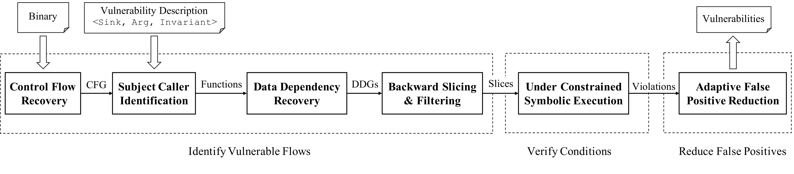

# Arbiter

Arbiter is a combination of static and dynamic analyses, built on top of angr, that can be used to detect some vulnerability classes.

All you need to use Arbiter is a sink that can be identified statically (like a call to a specific function), and a property that should not be violated at this sink.
Arbiter can then be used to detect if this property is violated at any of the corresponding sinks in the binary.


# Overview



# Research paper
We present our approach and the findings of this work in the following research paper:

**Arbiter: Bridging the Static and Dynamic Divide in Vulnerability Discovery on Binary Programs**

Jayakrishna Vadayath, Moritz Eckert, Kyle Zeng, Nicolaas Weideman, Gokulkrishna Praveen Menon, Yanick Fratantonio, Davide Balzarotti, Adam Doupé, Tiffany Bao, Ruoyu Wang, Christophe Hauser and Yan Shoshitaishvili

*In Proceedings of USENIX Security Symposium August 2022,*

If you use Arbiter in a scientific publication, we would appreciate citations using the following **Bibtex** entry:

```
@inproceedings {vadayath_arbiter_22,
title = {Arbiter: Bridging the Static and Dynamic Divide in Vulnerability Discovery on Binary Programs},
booktitle = {31st USENIX Security Symposium (USENIX Security 22)},
year = {2022},
}
```


# Installation

`python setup.py build && python setup.py install`


# Docker image

`docker pull 4rbit3r/arbiter:latest`


# Arbiter examples

This repository contains some examples of using Arbiter to detect different CWE types in the `examples` directory.


It also contains templates that were used for evaluating Arbiter on the Juliet Test suite as well as real world binaries in the `vuln_templates` directory.
